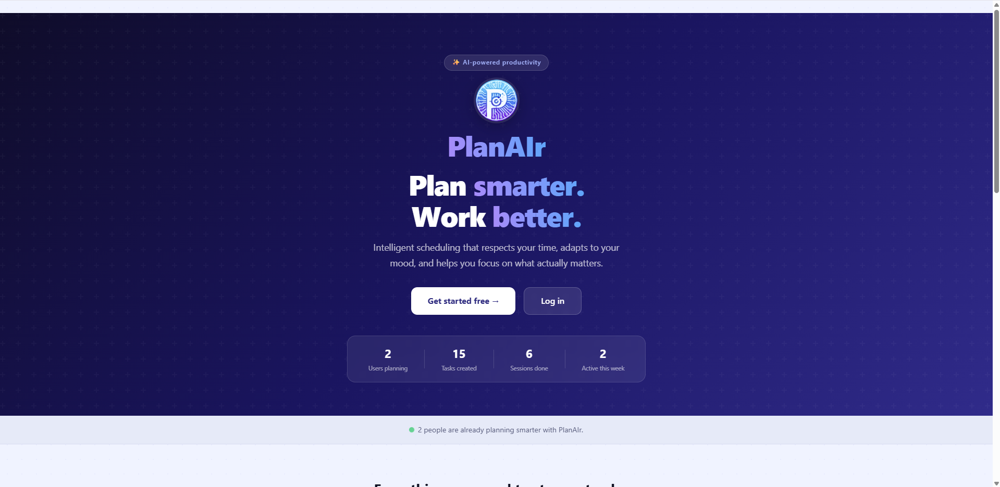
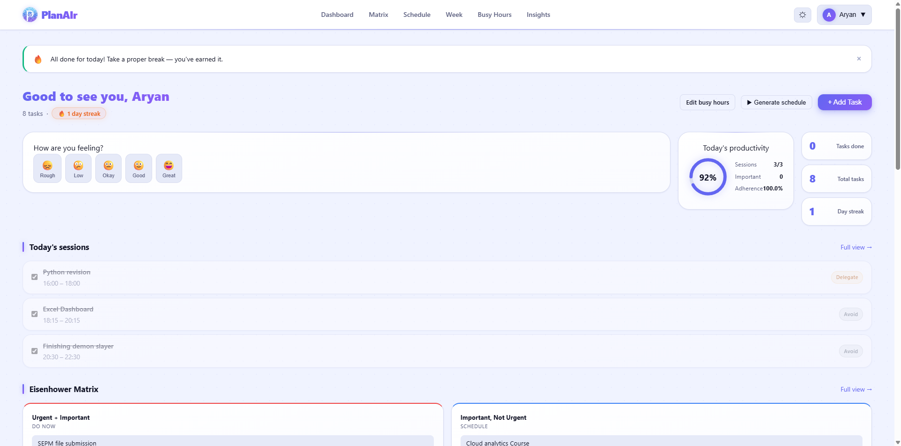
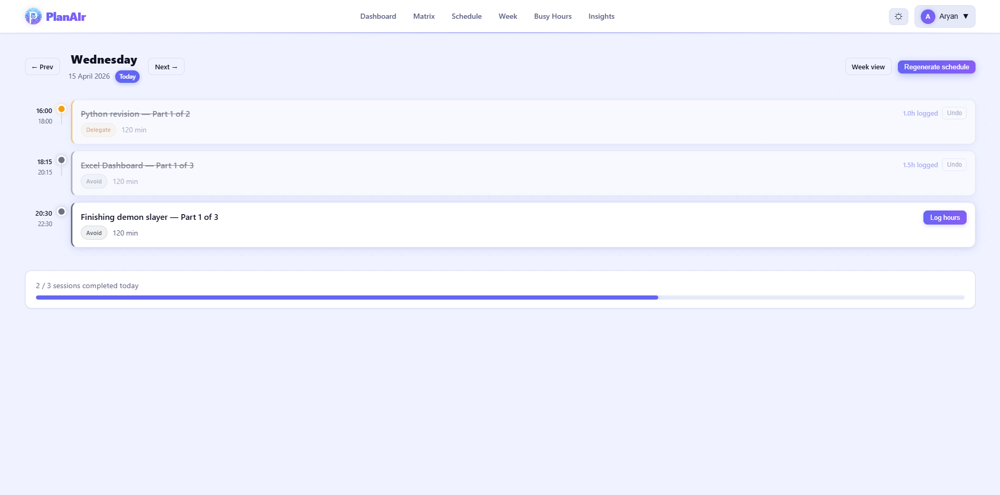
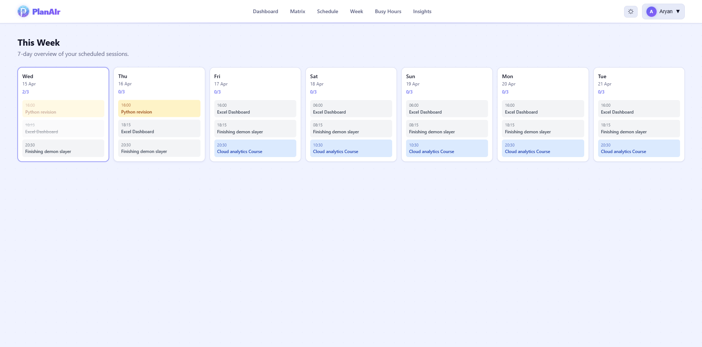
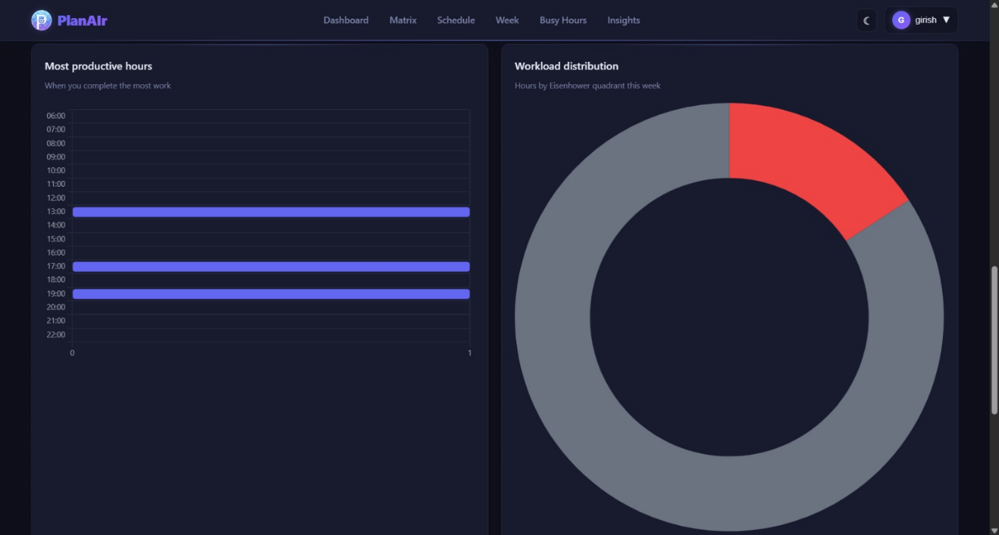
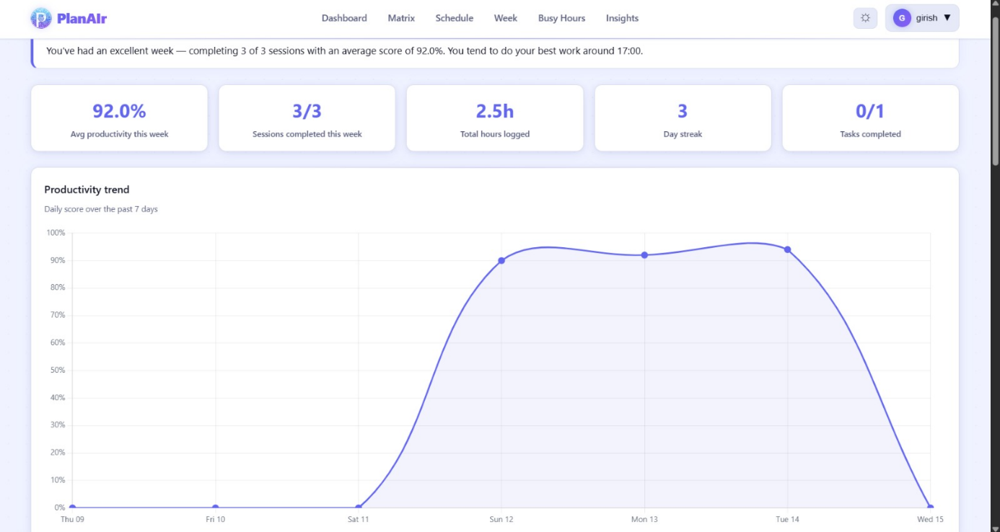

# PlanAIr 3.0: AI-Based Smart Productivity & Task Planning Web Application

<div align="center">

<p align="center">
  
</p>

**Intelligent scheduling that respects your time, adapts to your mood, and helps you focus on what actually matters.**

[](https://python.org)
[](https://flask.palletsprojects.com)
[](https://sqlite.org)
[](https://postgresql.org)
[](https://render.com)
[](LICENSE)

</div>

---

## Abstract

Students and professionals struggle to manage tasks, deadlines, and personal time efficiently in fast-paced environments. Existing tools like to-do apps and calendars lack intelligent scheduling, do not distribute work across available free time, and provide no adaptation to emotional state or behavioral patterns.

**PlanAIr** is an AI-based smart productivity and task planning web application that dynamically generates personalized schedules by combining scientific task prioritization (Eisenhower Matrix), intelligent time-slot allocation, mood-aware workload adjustment, session-level progress tracking, task dependency sequencing, and a rule-based smart suggestions engine, all in one integrated system.

---

## Table of Contents

- [Features](#features)
- [Project Members](#project-members)
- [Project Guide](#project-guide)
- [Subject Details](#subject-details)
- [Technology Stack](#technology-stack)
- [System Architecture](#system-architecture)
- [Database Schema](#database-schema)
- [Project Structure](#project-structure)
- [Core Algorithms](#core-algorithms)
- [Screenshots](#screenshots)
- [References](#references)

---

## Features

### Core Scheduling
- **Eisenhower Matrix**: tasks auto-classified into Do Now, Schedule, Delegate, Avoid based on urgency and importance scores
- **Intelligent Scheduling Engine**: distributes work sessions only within user-defined free hours, never during busy blocks
- **Deadline-First Ordering**: soonest deadlines get time slots before lower-priority tasks
- **Task Splitting**: large tasks automatically split into manageable sessions (max 2 hours each) across multiple days
- **15-Minute Break Buffers**: mandatory breaks inserted between consecutive sessions
- **Current-Time Awareness**: scheduling never places sessions in the past; today's slots start from now
- **Task Dependencies**: mark tasks as blocking others; scheduler sequences them in the correct order with cycle detection
- **Recurring Tasks**: daily or weekly recurring task support

### Progress & Logging
- **Log Hours Modal**: log full or partial hours per session; undo any logged entry
- **Task Progress Bars**: live progress bar per task showing completed vs estimated hours
- **Auto-Completion**: tasks automatically marked done when completed hours reach estimated hours
- **Edit & Reactivate**: editing estimated hours on a completed task reactivates it for scheduling

### Mood & Wellbeing
- **Daily Mood Check-In**: 5-point emoji scale logged once per day
- **Mood-Aware Scheduling**: low mood reduces session length to 45 min and skips low-priority tasks; high mood allows 150-min sessions
- **Instant Adjustment**: changing mood silently regenerates today's schedule immediately

### Productivity Analytics
- **Daily Productivity Score**: weighted formula: 40% completion rate, 30% important task completion, 20% schedule adherence, 10% streak bonus
- **Streak Tracking**: consecutive productive days tracked with milestone rewards at 3, 5, 7, 14, 21, 30 days
- **Insights Dashboard**: five Chart.js charts: weekly trend, completion bars, productive hour heatmap, quadrant distribution donut, mood trend

### Smart Suggestions
- **Rule-Based Engine**: six contextual rules: overdue tasks, daily overload, neglected important tasks, low mood, streaks, partial completion patterns
- **No Duplicates**: each suggestion type fires at most once per day per task
- **Auto-Dismiss**: stale suggestions from previous days are automatically resolved
- **Cleared on Logout**: all suggestions dismissed on logout and regenerated fresh on next login

### User Experience
- **Light & Dark Mode**: persisted per user in the database; premium neon-accent design with gradient surfaces
- **Responsive Design**: mobile-friendly with hamburger navigation
- **Invite-Only Access**: promo code required for signup; configurable via environment variable
- **Terms & Conditions**: modal with mandatory read-before-accept flow
- **Profile Dropdown**: avatar-based dropdown with edit busy hours and logout
- **Landing Page Stats**: live user count, task count, and session count from the database

### Security
- **Password Hashing**: Werkzeug PBKDF2-HMAC-SHA256 with random salt
- **CSRF Protection**: Flask-WTF on all forms and AJAX requests
- **Login Rate Limiting**: Flask-Limiter: 10 attempts per minute per IP
- **Secure Session Cookies**: HttpOnly, SameSite=Lax, Secure in production

---

## Project Members

| Name | UIN | Roll No | Role |
|------|-----|---------|------|
| Sakpal Girish Dayaghan | 231A011 | 49 | Team Leader: Backend, Scheduling Engine, Database |
| Pilwalkar Aryan Prakash | 231A016 | 43 | Frontend, UI/UX, Charts, Templates |
| Reshamwala Mohammed Kaif Sameer | 221A007 | 47 | Testing, Documentation, Deployment |

---

## Project Guide

| Name | Role |
|------|------|
| Prof. Ramkumar Maurya | Primary Guide |

---

## Subject Details

| Field | Detail |
|-------|--------|
| Class | TE (AI&DS): 2025–2026 |
| Subject | Mini Project 2B |
| Project Type | Mini Project |
| Department | Artificial Intelligence & Data Science Engineering |

---

## Technology Stack

### Backend
| Technology | Version | Purpose |
|------------|---------|---------|
| Python | 3.10+ | Core programming language |
| Flask | 3.x | Web framework and routing |
| Flask-SQLAlchemy | 3.x | ORM and database abstraction |
| Flask-Login | 0.6+ | Session management and authentication |
| Flask-WTF | 1.x | Form handling and CSRF protection |
| Flask-Limiter | 3.x | Rate limiting for security |
| Werkzeug | 3.x | Password hashing and WSGI utilities |
| Gunicorn | 21.x | Production WSGI server |
| python-dotenv | 1.x | Environment variable management |

### Frontend
| Technology | Purpose |
|------------|---------|
| HTML5 / CSS3 | Structure and styling |
| JavaScript (Vanilla) | Client-side interactivity |
| Chart.js (v4.4.1) | Analytics dashboard charts |
| Jinja2 | Server-side HTML templating |

### Database
| Environment | Database | Notes |
|-------------|----------|-------|
| Development | SQLite | Zero-config, single file |
| Production | PostgreSQL | Persistent, hosted on Render |

---

## System Architecture

```
┌─────────────────────────────────────────────────────────┐
│                     CLIENT (Browser)                    │
│              HTML + CSS + JavaScript                    │
└────────────────────────┬────────────────────────────────┘
                         │ HTTP / AJAX
┌────────────────────────▼────────────────────────────────┐
│                  FLASK APPLICATION                      │
│  ┌──────────┐ ┌──────────┐ ┌──────────┐ ┌──────────┐    │
│  │  auth_bp │ │ tasks_bp │ │sched_bp  │ │insigh_bp │    │
│  └──────────┘ └──────────┘ └──────────┘ └──────────┘    │
│                                                         │
│  ┌────────────┐ ┌─────────────┐ ┌──────────────────┐    │
│  │ scheduler  │ │ productivity│ │   suggestions    │    │
│  │  .py       │ │    .py      │ │      .py         │    │
│  └────────────┘ └─────────────┘ └──────────────────┘    │
└────────────────────────┬────────────────────────────────┘
                         │ SQLAlchemy ORM
┌────────────────────────▼────────────────────────────────┐
│                     DATABASE                            │
│   users │ tasks │ schedule_sessions │ busy_hours        │
│   mood_logs │ productivity_logs │ suggestions           │
│   task_dependencies                                     │
└─────────────────────────────────────────────────────────┘
```

### MVC Pattern

| Layer | Components |
|-------|-----------|
| **Model** | `app/models/`: User, Task, ScheduleSession, BusyHours, MoodLog, ProductivityLog, Suggestion, TaskDependency |
| **View** | `app/templates/`: Jinja2 HTML templates extending base.html |
| **Controller** | `app/routes/`: auth_bp, tasks_bp, schedule_bp, insights_bp |
| **Business Logic** | `scheduler.py`, `productivity.py`, `suggestions.py`, `insights.py` |

---

## Database Schema

```
users
├── id, username, email, password_hash
├── dark_mode, busy_hours_set, last_login, created_at
└── → busy_hours, tasks, schedule_sessions, mood_logs,
      productivity_logs, suggestions (all cascade delete)

tasks
├── id, user_id (FK), title, description
├── urgency (1-4), importance (1-4), estimated_hours
├── completed_hours, deadline, status, quadrant
├── is_recurring, recurrence_type, created_at
└── → schedule_sessions, suggestions, task_dependencies

schedule_sessions
├── id, user_id (FK), task_id (FK)
├── date, start_time, end_time, session_label
├── is_completed, completed_at, logged_hours

task_dependencies
├── id, user_id (FK)
├── task_id (FK): the dependent task
├── depends_on_id (FK): the blocking task
└── UNIQUE(task_id, depends_on_id)

busy_hours
├── id, user_id (FK)
├── day_of_week (0=Mon..6=Sun), start_time, end_time, label

productivity_logs
├── id, user_id (FK), date (UNIQUE per user)
├── score, sessions_completed, sessions_total
├── important_completed, schedule_adherence

mood_logs
├── id, user_id (FK), date (UNIQUE per user)
├── mood_score (1-5), note

suggestions
├── id, user_id (FK), created_at
├── suggestion_type, message, is_dismissed
└── related_task_id (FK, nullable)
```

---

## Project Structure

```
planair/
├── backend/
│   ├── app/
│   │   ├── __init__.py          # App factory: db, login, csrf, limiter
│   │   ├── config.py            # Dev / Production config classes
│   │   ├── forms.py             # WTForms: signup, login, task, busy hours
│   │   ├── scheduler.py         # Core scheduling engine with dependency sort
│   │   ├── productivity.py      # Score calculation and streak tracking
│   │   ├── suggestions.py       # Rule-based suggestion engine
│   │   ├── insights.py          # Analytics data functions for charts
│   │   ├── models/
│   │   │   ├── user.py          # User model with auth helpers
│   │   │   ├── task.py          # Task + TaskDependency models
│   │   │   ├── schedule.py      # ScheduleSession + BusyHours models
│   │   │   └── mood.py          # MoodLog + ProductivityLog + Suggestion
│   │   ├── routes/
│   │   │   ├── auth.py          # Landing, signup, login, logout, dark mode
│   │   │   ├── tasks.py         # Dashboard, task CRUD, matrix, dependencies
│   │   │   ├── schedule.py      # Busy hours, schedule view, session logging
│   │   │   └── insights.py      # Analytics dashboard
│   │   ├── templates/
│   │   │   ├── base.html        # Master layout: navbar, flash, footer
│   │   │   ├── landing.html     # Public landing page with live stats
│   │   │   ├── auth/            # signup.html, login.html
│   │   │   ├── tasks/           # dashboard.html, matrix.html, edit_task.html
│   │   │   ├── schedule/        # busy_hours.html, schedule_view.html, week_view.html
│   │   │   ├── insights/        # insights.html
│   │   │   └── errors/          # 404.html, 500.html
│   │   └── static/
│   │       ├── css/main.css     # Full theme: neon glow, light/dark variables
│   │       ├── js/main.js       # Dark mode toggle, mobile nav, profile dropdown
│   │       └── images/logo.png  # PlanAIr logo
│   ├── run.py                   # Entry point: selects config by environment
│   ├── Procfile                 # Render start command: gunicorn run:app
│   └── requirements.txt
├── docs/
│   └── planning.md              # Database schema notes and design decisions
├── .gitignore
└── README.md
```

---

## Core Algorithms

### Scheduling Algorithm

```
1. Delete all future unfinished sessions (clean slate)
2. Fetch tasks: pending / in-progress / delayed
3. Resolve dependency order using Kahn's topological sort
   - Tasks blocked by undone external tasks → marked delayed, skipped
4. Apply stable deadline-first sort within dependency order
   - Primary: soonest deadline first
   - Secondary: highest priority score (quadrant + deadline boost)
5. Apply mood settings (max session length, skip quadrants)
6. For each task in order:
   a. remaining = estimated_hours - completed_hours
   b. For each day from today within deadline window:
      - Compute free slots (working hours minus busy blocks)
      - Subtract booked sessions + 15min break buffers
      - Find first valid gap ≥ session length
      - Create ScheduleSession record
      - Subtract scheduled minutes from remaining
7. Commit all sessions
```

### Priority Score Formula

```
base_score = quadrant_weight (do_now=100, schedule=75, delegate=50, avoid=25)

deadline_boost:
  ≤ 1 day  → +50
  ≤ 3 days → +30
  ≤ 7 days → +15

priority_score = base_score + deadline_boost
```

### Productivity Score Formula

```
score = (completion_rate × 40)
      + (important_completion_rate × 30)
      + (schedule_adherence × 20)
      + (min(streak × 2, 10) × 0.1 × 10)

capped at 100.0
```

---

## Screenshots

### Landing Page

<p align="center">
  
</p>

### User Dashboard

<p align="center">
  
</p>

### Daily Schedule

<p align="center">
  
</p>

### Weekly Schedule

<p align="center">
  
</p>

### Workload Distribution

<p align="center">
  
</p>

### Productivity Insights

<p align="center">
  
</p>

| Page | Description |
|------|-------------|
| Landing Page | Hero with live stats, features grid, how-it-works steps |
| Dashboard | Greeting, mood check-in, productivity circle, today's sessions, matrix |
| Schedule View | Daily timeline with log hours modal and progress bar |
| Week View | 7-day overview with color-coded quadrant pills |
| Insights | 5 Chart.js charts: trend, completion, hours, quadrant, mood |
| Matrix View | Full 2×2 Eisenhower Matrix with all tasks |
| Busy Hours | Interactive drag-to-select grid for weekly schedule |

---

## References

1. Covey, S. R. (1989). *The 7 Habits of Highly Effective People*. Free Press, New York.
2. Newport, C. (2016). *Deep Work: Rules for Focused Success in a Distracted World*. Grand Central Publishing.
3. Isen, A. M., Daubman, K. A., & Nowicki, G. P. (1987). Positive affect facilitates creative problem solving. *Journal of Personality and Social Psychology*, 52(6), 1122–1131.
4. Grinberg, A. (2018). *Flask Web Development* (2nd ed.). O'Reilly Media.
5. Bayer, M. (2012). SQLAlchemy: The Architecture of Open Source Applications. Retrieved from https://www.aosabook.org/en/sqlalchemy.html
6. Chart.js Documentation (2024). Retrieved from https://www.chartjs.org/docs/latest/
7. Flask Documentation (2024). Retrieved from https://flask.palletsprojects.com/
8. OWASP Foundation (2024). CSRF Prevention Cheat Sheet. Retrieved from https://cheatsheetseries.owasp.org/

---

<div align="center">

Made with dedication by **Girish Sakpal**

Department of Artificial Intelligence & Data Science Engineering: 2025–2026

</div>
